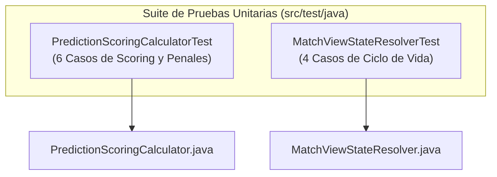

# Suite de Pruebas Unitarias — Backend Polla Mundialista 2026

> **Ubicación:** `PollaMundialista-Backend/src/test/`  
> **Framework:** JUnit 5 (Jupiter) + Mockito + AssertJ  
> **Versión de Java:** Java 21 LTS  
> **Estado:** 🟢 **10/10 Pruebas Aprobadas (`BUILD SUCCESS`)**

---

## 1. Visión General de la Suite

Esta suite contiene pruebas unitarias de aislamiento diseñadas para verificar la lógica algorítmica y las reglas de negocio del dominio sin requerir bases de datos, redes ni servicios externos.



---

## 2. Detalle de Clases y Pruebas Implementadas

---

### A. `PredictionScoringCalculatorTest.java` (Motor de Scoring)
* **Archivo:** [`src/test/java/com/mundialpolla/scoring/application/PredictionScoringCalculatorTest.java`](file:///c:/Users/tomas/IdeaProjects/PollaMundialista/PollaMundialista-Backend/src/test/java/com/mundialpolla/scoring/application/PredictionScoringCalculatorTest.java)
* **Objetivo:** Garantizar la precisión del cálculo de puntos según el reglamento oficial del torneo.

| # | Método de Prueba | Escenario Evaluado | Puntos Base | Bonus | Total |
|:---:|---|---|:---:|:---:|:---:|
| **1** | `shouldAward5PointsForExactScoreInGroupStage` | Pronóstico `2-1` vs Real `2-1` (Fase de Grupos) | 5 | 0 | **5 pts** |
| **2** | `shouldAward3PointsForCorrectWinnerInGroupStage` | Pronóstico `3-0` vs Real `2-1` (Victoria Local) | 3 | 0 | **3 pts** |
| **3** | `shouldAward3PointsForCorrectDrawInGroupStage` | Pronóstico `1-1` vs Real `2-2` (Empate) | 3 | 0 | **3 pts** |
| **4** | `shouldAward0PointsForWrongPrediction` | Pronóstico `1-0` vs Real `0-2` (Resultado Opuesto) | 0 | 0 | **0 pts** |
| **5** | `shouldAwardBonusPointForKnockoutQualifiedTeamInPenalties` | Empate `1-1` + Acierto de Selección Clasificada en Penales | 3 | 1 | **4 pts** |
| **6** | `shouldThrowExceptionIfMatchHasNoConfirmedScore` | Partido sin resultado confirmado (`homeScore == null`) | N/A | N/A | `IllegalArgumentException` |

#### Estructura del Código de Prueba (Patrón AAA: Arrange-Act-Assert)
```java
@Test
@DisplayName("Caso 1: Marcador Exacto en Fase de Grupos -> Otorga 5 puntos base")
void shouldAward5PointsForExactScoreInGroupStage() {
    // 1. Arrange: Mocks de pronóstico y partido con resultado 2-1
    when(prediction.getPredictedHomeScore()).thenReturn(2);
    when(prediction.getPredictedAwayScore()).thenReturn(1);
    when(match.getHomeScore()).thenReturn(2);
    when(match.getAwayScore()).thenReturn(1);
    when(stage.getType()).thenReturn(StageType.GROUP_STAGE);

    // 2. Act: Ejecutar el calculador
    PredictionScoreCalculation result = calculator.calculate(prediction);

    // 3. Assert: Validar 5 puntos exactos
    assertAll(
        () -> assertEquals(5, result.basePoints()),
        () -> assertEquals(0, result.qualifiedTeamBonus()),
        () -> assertEquals(5, result.totalPoints()),
        () -> assertTrue(result.exactScore()),
        () -> assertTrue(result.correctOutcome())
    );
}
```

---

### B. `MatchViewStateResolverTest.java` (Estados Temporales)
* **Archivo:** [`src/test/java/com/mundialpolla/matches/application/MatchViewStateResolverTest.java`](file:///c:/Users/tomas/IdeaProjects/PollaMundialista/PollaMundialista-Backend/src/test/java/com/mundialpolla/matches/application/MatchViewStateResolverTest.java)
* **Objetivo:** Validar la resolución reactiva de los estados del partido según la marca de tiempo `ApplicationClock.now()`.

| # | Método de Prueba | Condición Temporal / Estado del Partido | Estado Resultante | `predictionsOpen` | `predictionsClosed` |
|:---:|---|---|---|:---:|:---:|
| **1** | `shouldResolveOpenForPredictionsWhenBeforeCloseTime` | Reloj antes de `predictionClosesAt` | `OPEN_FOR_PREDICTIONS` | `true` | `false` |
| **2** | `shouldResolvePredictionClosedWhenBetweenCloseAndStart` | Reloj entre `predictionClosesAt` y `startsAt` | `PREDICTION_CLOSED` | `false` | `true` |
| **3** | `shouldResolveCancelledWhenMatchStatusIsCancelled` | `match.status == CANCELLED` | `CANCELLED` | `false` | `true` |
| **4** | `shouldResolvePostponedWhenMatchStatusIsPostponed` | `match.status == POSTPONED` | `POSTPONED` | `false` | `true` |

#### Estructura del Código de Prueba
```java
@Test
@DisplayName("Caso 1: Antes del cierre -> Estado OPEN_FOR_PREDICTIONS")
void shouldResolveOpenForPredictionsWhenBeforeCloseTime() {
    when(match.getStatus()).thenReturn(MatchStatus.SCHEDULED);
    when(match.getPredictionClosesAt()).thenReturn(Instant.parse("2026-06-11T18:45:00Z"));

    MatchViewState state = resolver.resolve(match, Instant.parse("2026-06-11T18:40:00Z"));

    assertEquals(MatchViewStatus.OPEN_FOR_PREDICTIONS, state.status());
    assertTrue(state.predictionsOpen());
    assertFalse(state.predictionsClosed());
}
```

---

## 3. Instrucciones de Ejecución

### Opción 1: Consola PowerShell / Terminal CLI
```powershell
# 1. Configurar JAVA_HOME a JDK 21
$env:JAVA_HOME = "C:\Program Files\Java\jdk-21.0.11"
$env:Path = "$($env:JAVA_HOME)\bin;$($env:Path)"

# 2. Navegar a la carpeta del Backend
cd c:\Users\tomas\IdeaProjects\PollaMundialista\PollaMundialista-Backend

# 3. Ejecutar la suite unitaria
.\mvnw.cmd test "-Dtest=PredictionScoringCalculatorTest,MatchViewStateResolverTest"
```

### Opción 2: Desde IntelliJ IDEA / Eclipse
1. Navega a `src/test/java/com/mundialpolla/`.
2. Haz clic derecho sobre el paquete `application` o sobre cualquier archivo de prueba `*Test.java`.
3. Selecciona **"Run 'Tests in ...'"** (`Ctrl + Shift + F10`).
4. Verás la barra verde con **10/10 Tests Passed** en milisegundos.

---

## 4. Integración Continua (CI/CD)

Estas pruebas están configuradas para ejecutarse automáticamente en la fase de `test` del ciclo de vida Maven (`mvn test`), impidiendo el despliegue de cualquier cambio que introduzca regresiones en las fórmulas de puntuación o en las ventanas de tiempo de los partidos.
